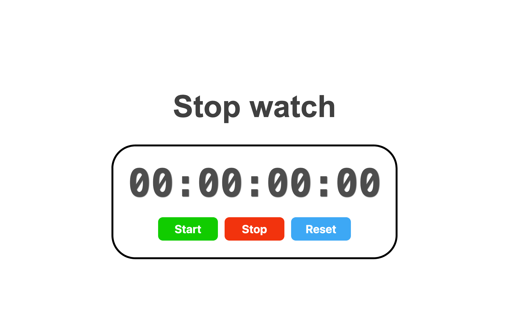

# Simple Stopwatch

## Summary
This is a simple stopwatch project built with HTML, CSS, and JavaScript. It provides functionality to start, stop, and reset the stopwatch.

## Project Link
[Simple Stopwatch](https://billalben.github.io/stop-watch/)

## Screenshot

## Features
- Start, stop, and reset functionality.
- Accurate time tracking.
- User-friendly interface.
- Responsive design for various screen sizes.
